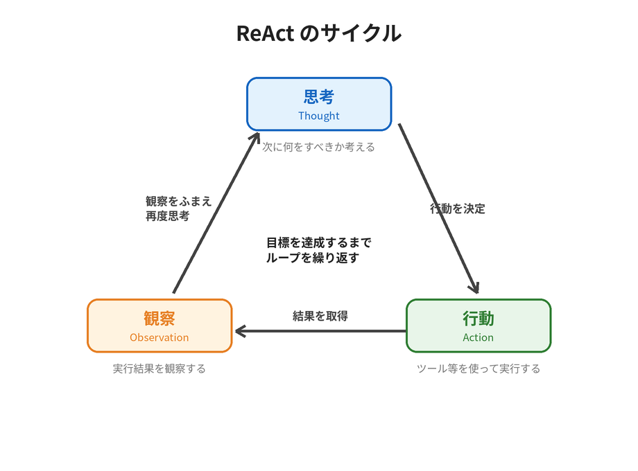

# kiro概要

## アジェンダ

- AI エージェントとは
- kiro とは

## AI エージェントとは?

AI エージェントは、人間に代わって様々な作業が出来る AI。
従来の ChatGPT のような LLM との違いは、「自分で考えて、行動出来るところ」

例えば?

「渋谷駅周辺でオススメの肉バルを教えて下さい。」
今までの AI チャットなら、学習した内容から回答していた。
AI エージェントなら、渋谷駅周辺のお店を検索して、該当するお店を回答出来る。

もちろんこれはあくまで一例。
簡単な調べものから資料作成、開発から運用業務まで何でも出来る。

なぜこんなことが出来るのか?
それは、ReAct と呼ばれる手法のおかげ。

ReAct とは、AI エージェントを構築する為のフレームワークの1つ。
これまでの LLM を扱う手法は、「考える」ことに重きを置いていた(Chain of Thought)。
ReAct では、「思考」と「行動」を組み合わせる。

ポイントは、解決策を考えて、行動して、結果を観察して、、、のループを回していること。
この「Action」で選べるものを増やす事で、様々な業務に対応出来るようになる。

## Kiro とは?

Kiro は、AWS が提供する **AI エージェント型の開発ツール**。
前述の AI エージェントが「開発」に特化したもの、とイメージするとわかりやすい。
自然言語で対話しながら、コードの実装・修正・テスト・運用までを AI に任せられる。

Kiro の最大の特徴は **spec(仕様)駆動開発**。
いきなりコードを書かせるのではなく、

- 要件 → 設計 → タスク のように仕様をドキュメントとして固めてから実装に進む

ことで、大規模・複雑な開発でも AI が筋道を立てて作業できる。
他にも、AI に守らせたいルールを定義する **Steering**、作業を自動化する **Hooks**、
専門特化した **カスタムエージェント** など、開発を支える仕組みが揃っている。

### 利用形態

Kiro は大きく 2 つの形態で使える。

| 形態 | 概要 |
| --- | --- |
| **Kiro IDE** | デスクトップ向けの統合開発環境(IDE)。エディタ上で GUI を使いながら、Kiro の全機能を対話的に利用できる。 |
| **Kiro CLI** | ターミナルで動くコマンドライン版。エディタを離れず、シェルや CI/CD などの自動化(ヘッドレス実行)にも組み込める。 |

本ワークショップでは、code-server 上で **Kiro CLI** を使って開発を進めていく。
